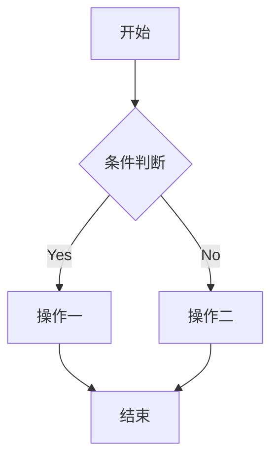

# benchmark


```markdown
# GitHub Markdown 语法测试大全 (H1)
<!-- 这是一个 HTML 注释，在渲染时不可见 -->
本文档旨在全面测试 GitHub Flavored Markdown (GFM) 的各种语法特性。
---
<!-- 水平分割线 -->
## 基础格式 (H2)
### 标题 (Headings) (H3)
<!-- 测试 H1 到 H6 -->
# 一级标题 (H1)
## 二级标题 (H2)
### 三级标题 (H3)
#### 四级标题 (H4)
##### 五级标题 (H5)
###### 六级标题 (H6)
---
### 强调 (Emphasis) (H3)
<!-- 测试斜体、粗体、删除线及其组合 -->
*这是斜体文本* (星号)
_这也是斜体文本_ (下划线)
**这是粗体文本** (双星号)
__这也是粗体文本__ (双下划线)
~~这是删除线文本~~ (波浪线)
***这是粗斜体文本*** (三星号)
___这也是粗斜体文本___ (三下划线)
**_这也是粗斜体文本_** (混合)
*__这也是粗斜体文本__* (混合)
~~**加粗的删除线**~~
~~*斜体的删除线*~~
---
### 列表 (Lists) (H3)
#### 无序列表 (Unordered Lists) (H4)
<!-- 测试不同标记和嵌套 -->
* 项目一 (星号)
* 项目二
  - 子项目 A (减号)
  + 子项目 B (加号)
    * 孙项目 1 (星号)
* 项目三
#### 有序列表 (Ordered Lists) (H4)
<!-- 测试数字和嵌套 -->
1. 第一项
2. 第二项
   1. 子项 1 (自动编号)
   2. 子项 2
      i. 更深层子项 (使用 i. 可能不被所有解析器支持为有序，但 GFM 通常处理为普通列表项)
3. 第三项
99. 从 99 开始的项 (起始编号)
#### 任务列表 (Task Lists - GFM Specific) (H4)
<!-- 测试 GFM 任务列表 -->
- [x] 已完成的任务
- [ ] 未完成的任务
  - [ ] 子任务 A (未完成)
  - [x] 子任务 B (已完成)
- [ ] 另一个未完成的任务
---
### 链接 (Links) (H3)
<!-- 测试行内链接、引用链接和自动链接 -->
#### 行内链接 (Inline Links) (H4)
访问 。
这是一个指向 [相对路径的文件](./README.md) 的链接。
#### 引用链接 (Reference Links) (H4)
我经常在 [GitHub][gh-site] 上浏览项目，也会查看 [Markdown 指南][md-guide]。
有时也会用到 [Google][google-search]。
<!-- 链接引用定义，可以放在文档任何位置 -->
[gh-site]: https://github.com 'GitHub 官方网站'
[md-guide]: https://guides.github.com/features/mastering-markdown/ "Mastering Markdown"
[google-search]: https://google.com
#### 自动链接 (Autolinks) (H4)
URL: <https://www.github.com>
邮箱: <mailto:test@example.com> (请注意，这可能不会被渲染为可点击的 mailto 链接，取决于环境)
---
### 图片 (Images) (H3)
<!-- 测试行内图片和引用图片 -->
#### 行内图片 (Inline Images) (H4)
#### 引用图片 (Reference Images) (H4)
![GitHub Octocat][octocat-img]
<!-- 图片引用定义 -->
[octocat-img]: https://github.githubassets.com/images/modules/logos_page/Octocat.png "GitHub Octocat吉祥物 - 引用"
---
### 代码 (Code) (H3)
#### 行内代码 (Inline Code) (H4)
使用反引号 `` ` `` 来标记行内代码，例如 `const message = "Hello World";`。
如果代码本身包含反引号，可以使用双反引号包裹： `` ` `` `code with backtick` `` ` ``。
#### 围栏代码块 (Fenced Code Blocks) (H4)
<!-- 测试无语言指定和指定语言的语法高亮 -->
```
这是一个没有指定语言的代码块。
Plain text goes here.
```
指定语言（例如 JavaScript）以启用语法高亮：
```javascript
// Javascript 示例
function greet(name) {
  console.log(`Hello, ${name}!`);
}
greet('GitHub User');
```
指定语言（例如 Python）：
```python
# Python 示例
def fibonacci(n):
    a, b = 0, 1
    while a < n:
        print(a, end=' ')
        a, b = b, a+b
    print()
fibonacci(10)
```
指定语言（例如 Diff）：
```diff
- 这是被删除的行
+ 这是被添加的行
! 这是被修改的行 (某些 diff 高亮支持)
# 这是一个注释行
```
指定语言（例如 Mermaid - GFM 支持图表）

---
### 块引用 (Blockquotes) (H3)
<!-- 测试单层和嵌套块引用 -->
> 这是一个块引用。
> 它可以包含多行文本。
>
> 这是同一个块引用中的另一个段落。
> 嵌套块引用：
>> 第二层引用。
>>> 第三层引用。
>>
>> 回到第二层。
> 回到第一层。
---
### 表格 (Tables - GFM Specific) (H3)
<!-- 测试 GFM 表格和对齐 -->
| 表头 1 (左对齐) | 表头 2 (居中对齐) | 表头 3 (右对齐) |
| :----------- | :----------: | -----------: |
| 单元格 1,1   | 单元格 1,2   | 单元格 1,3   |
| 单元格 2,1   | 单元格 2,2   | 单元格 2,3   |
| 短文本       |  这是一个较长的文本 |  非常非常非常长的文本内容 |
| 包含 `代码`  | *斜体* 和 **粗体** | [链接](https://github.com) |
---
### 脚注 (Footnotes - GFM Specific) (H3)
<!-- 测试 GFM 脚注 -->
这是一个带有脚注的句子[^1]。这是另一个脚注[^longnote]。
[^1]: 这是第一个脚注的定义。
[^longnote]: 这是另一个脚注的定义，它可以包含更长的内容，甚至可以包含多个段落。
    这是脚注的第二段。代码块也可以放在脚注里：
    ```
    Footnote code example.
    ```
---
### HTML (Raw HTML) (H3)
<!-- 测试直接嵌入 HTML -->
Markdown 通常允许嵌入原始 HTML 标签。
<p style="color:red;">这段文本应该是红色的（如果渲染器支持）。</p>
可以使用 HTML 来实现更复杂的布局或 Markdown 不支持的元素：
<details>
  <summary>点击这里展开/折叠 (使用 HTML details 标签)</summary>
  <p>这里是隐藏的详细内容。</p>
  <ul>
    <li>列表项 1</li>
    <li>列表项 2</li>
  </ul>
</details>
<kbd>Ctrl</kbd> + <kbd>C</kbd> (使用 HTML kbd 标签模拟键盘按键)
---
### 转义字符 (Escaping Characters) (H3)
<!-- 测试反斜杠转义 -->
如果你想显示 Markdown 语法字符本身，而不是让它们被解析，可以使用反斜杠 `\` 进行转义：
\*这不是斜体\*
\*\*这不是粗体\*\*
\`这不是代码\`
\[这不是链接](...)
\# 这不是标题
\> 这不是块引用
\- 这不是列表项
1\. 这不是有序列表项
\!\[这不是图片](...)
\~~这不是删除线~~
\[^not a footnote]
---
### GitHub 特定功能 (GFM Specific Features) (H3)
#### Emoji (GFM) (H4)
<!-- 测试 Emoji 快捷方式 -->
GitHub 支持 Emoji! :smile: :rocket: :octocat: :+1: 👍
#### 提及和引用 (Mentions & References - GFM) (H4)
<!-- 测试 @提及, #问题/PR引用, 提交SHA引用 -->
*   **@mention**: 提及 GitHub 用户，例如 @brmdm2020 (注意：这可能会通知真实用户，测试时请谨慎或使用不存在的用户名如 @github-test-user-nonexistent)。
*   **Issue/PR reference**: 引用当前仓库中的 Issue 或 Pull Request，例如 #1。也可以引用其他仓库的，例如 `github/markup#1`。
*   **Commit reference**: 引用当前仓库中的提交 SHA，例如 `16c999e8c71134401a78d4d46435517b2271d6ac` (这是一个示例 SHA)。也可以引用其他仓库的提交，例如 `github/markup@16c999e8c71134401a78d4d46435517b2271d6ac`。
---
测试结束。将此内容粘贴到 GitHub 的 Markdown 编辑器（例如 Issue、PR 描述、README.md 文件）中，即可预览和验证各种语法的渲染效果。
```